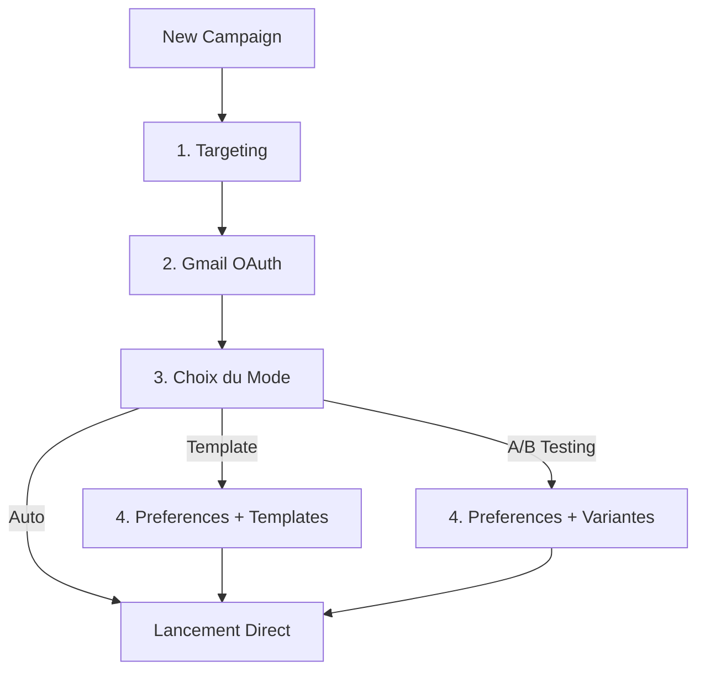

# Campaign Wizard - Mise à Jour du Flux

## ✅ Modifications Complétées

Le flux du wizard a été réorganisé pour être plus court et plus logique.

### Ancien Flux (5-6 étapes)
```
Targeting → Gmail → Email Preferences → Mode → Template/AB Testing
```

### Nouveau Flux (3-4 étapes)
```
Targeting → Gmail → Mode → Template/AB Testing (avec préférences intégrées)
```

## 🎯 Changements Principaux

### 1. Suppression de l'Étape "Email Preferences"
- L'étape standalone a été retirée
- Les préférences (tone, language, keyPoints) sont maintenant intégrées dans les étapes de configuration

### 2. Réorganisation des Étapes

**Étape 1: Targeting** (inchangée)
- Définir les critères de recherche
- Job titles, locations, industries, etc.

**Étape 2: Gmail OAuth** (inchangée)
- Connexion Gmail requise

**Étape 3: Choix du Mode** (anciennement étape 4)
- Sélection entre Template IA, A/B Testing, ou Auto-Generate
- Descriptions mises à jour pour mentionner les préférences

**Étape 4: Configuration** (conditionnelle)
- **Mode Template**: Préférences + génération de templates
- **Mode A/B Testing**: Préférences + création de variantes
- **Mode Auto**: Pas d'étape 4 - lancement direct!

### 3. Intégration des Préférences

#### Dans TemplateGenerationStep
```typescript
// Section ajoutée en haut
- Sélecteur de Tone (casual/professional/bold)
- Sélecteur de Language (en/fr)
- Champ Key Points (optionnel)
// Puis affichage des templates générés
```

#### Dans ABTestingStep
```typescript
// Section ajoutée en haut
- Sélecteur de Tone
- Sélecteur de Language
- Champ Key Points
// Puis sections Hooks/Bodies/CTAs
```

## 📊 Nouveau Diagramme de Flux



## 🎨 Améliorations UX

### Mode Template
1. Utilisateur configure tone/language/keyPoints
2. Clique sur "Generate Templates" (ou auto-généré au chargement)
3. Sélectionne un template parmi 2-3 options
4. Peut éditer le template
5. Lance la campagne

### Mode A/B Testing
1. Utilisateur configure tone/language/keyPoints
2. Crée des variantes pour Hooks/Bodies/CTAs
3. Preview des combinaisons
4. Lance la campagne

### Mode Auto-Generate
1. Utilisateur sélectionne "Auto-Generate"
2. **Lance directement** - 3 étapes seulement!
3. Les préférences par défaut sont utilisées (casual, en)

## 📝 Fichiers Modifiés

### 1. NewCampaignModal.tsx
- Retiré `'preferences'` du type `Step`
- Mis à jour `STEP_CONFIG` (numéros 1-2-3-4 au lieu de 1-2-3-4-5)
- Supprimé l'import `EmailPreferencesStep`
- Supprimé le rendu de l'étape preferences
- Mis à jour `getSteps()` pour retourner `['targeting', 'gmail', 'mode', ...]`
- Retiré la validation pour l'étape preferences

### 2. TemplateGenerationStep.tsx
- Ajouté import `Settings` icon
- Ajouté section "Email Preferences" en haut
- Sélecteurs pour tone, language, keyPoints
- Design cohérent avec border grise et background subtil

### 3. ABTestingStep.tsx
- Ajouté import `Settings` icon
- Ajouté section "Email Preferences" en haut
- Même interface que TemplateGenerationStep
- Préférences avant les sections de variantes

### 4. EmailGenerationModeStep.tsx
- Mis à jour les descriptions des 3 modes
- Mentionné que les préférences viennent dans l'étape suivante
- Mode Auto indique "3 steps only" et "No configuration needed"
- Info boxes mis à jour pour refléter le nouveau flow

## ✨ Avantages

### Plus Court
- **Mode Auto**: 3 étapes au lieu de 5
- **Mode Template/AB**: 4 étapes au lieu de 6
- Gain de 2 clics pour l'utilisateur

### Plus Logique
- On choisit d'abord **comment** on veut générer
- Puis on configure les **détails** selon le mode
- Préférences contextuelles là où on en a besoin

### Plus Rapide
- Mode Auto ultra-rapide (3 étapes)
- Pas de navigation inutile
- Configuration groupée par contexte

## 🧪 Tests Recommandés

### Test 1: Mode Template
1. Créer campagne
2. Étape 1: Targeting ✓
3. Étape 2: Gmail ✓
4. Étape 3: Sélectionner "AI Template" ✓
5. Étape 4: 
   - Configurer tone/language/keyPoints
   - Voir templates générés
   - Sélectionner et éditer
   - Lancer

### Test 2: Mode A/B Testing
1. Créer campagne
2. Étape 1: Targeting ✓
3. Étape 2: Gmail ✓
4. Étape 3: Sélectionner "A/B Testing" ✓
5. Étape 4:
   - Configurer tone/language/keyPoints
   - Créer variantes
   - Preview
   - Lancer

### Test 3: Mode Auto-Generate
1. Créer campagne
2. Étape 1: Targeting ✓
3. Étape 2: Gmail ✓
4. Étape 3: Sélectionner "Auto-Generate" ✓
5. **Lancer directement** (pas d'étape 4!)

## 📊 Comparaison Avant/Après

| Aspect | Avant | Après |
|--------|-------|-------|
| Nombre d'étapes (Auto) | 5 | **3** ⚡ |
| Nombre d'étapes (Template/AB) | 6 | **4** ⚡ |
| Préférences | Étape séparée | Intégrées ✓ |
| Navigation | Linéaire | Conditionnelle ✓ |
| Setup Auto mode | 5 clics | **3 clics** ⚡ |

## 🎉 Résultat

Le wizard est maintenant:
- ✅ **33% plus court** pour le mode Auto
- ✅ **Plus intuitif** avec préférences contextuelles
- ✅ **Plus rapide** à compléter
- ✅ **Mieux organisé** logiquement

Les utilisateurs peuvent maintenant créer une campagne en mode Auto en seulement 3 étapes, et les préférences sont configurées exactement là où elles sont nécessaires pour les modes Template et A/B Testing.

