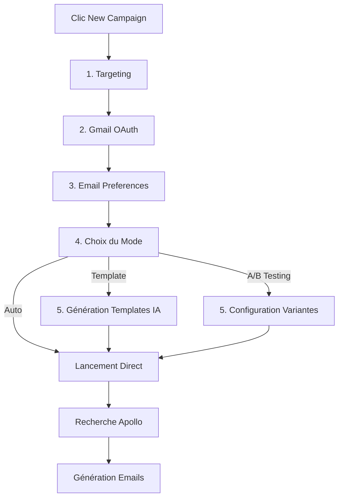

# Campaign Wizard - Résumé de l'Implémentation

## 🎯 Objectif

Refonte complète du système de création de campagne avec 3 modes de génération d'emails et un design cohérent utilisant la palette verte/grise de l'application.

## ✅ Implémentation Complète

### 1. Design System (`src/lib/designSystem.ts`)
- Constantes de couleurs cohérentes
- Classes Tailwind réutilisables
- Palette verte: `#b7e219`, `#a5cb17`, `#9fc015`
- Palette grise dark: `#0a0a0a`, `#1a1a1a`, `#2b2a2c`

### 2. Nouveaux Composants Frontend

#### EmailGenerationModeStep (`src/components/campaigns/steps/EmailGenerationModeStep.tsx`)
- 3 cartes de sélection: Template IA, A/B Testing, Auto-génération
- Animations Framer Motion
- Badge "Recommended" sur le mode Template
- Checkmark vert quand sélectionné
- Info box avec description du mode choisi

#### TemplateGenerationStep (`src/components/campaigns/steps/TemplateGenerationStep.tsx`)
- Génération de 2-3 templates via OpenAI
- Affichage avec preview (sujet + corps)
- Highlighting des merge fields: `{{firstName}}`, `{{company}}`, etc.
- Mode édition avec textarea
- Bouton "Regenerate Templates"
- Validation: au moins 1 template sélectionné

#### ABTestingStep (`src/components/campaigns/steps/ABTestingStep.tsx`)
- 3 sections modulaires: Hooks, Bodies, CTAs
- Système de tabs pour naviguer entre sections
- Ajout/suppression de variantes (max 3-5 par section)
- Preview en temps réel avec sélecteurs
- Validation: au moins 1 variante par section

### 3. Modal Refondé (`src/components/campaigns/NewCampaignModal.tsx`)

#### Nouvelles Étapes
```typescript
type Step = 'targeting' | 'gmail' | 'preferences' | 'mode' | 'template' | 'abtest';
```

#### Navigation Conditionnelle
- Si mode = 'template' → afficher TemplateGenerationStep
- Si mode = 'abtest' → afficher ABTestingStep
- Si mode = 'auto' → skip direct à launch

#### Interface CampaignData Étendue
```typescript
interface CampaignData {
  // ... champs existants
  emailGenerationMode?: 'template' | 'abtest' | 'auto';
  selectedTemplate?: { id, subject, body };
  abTestConfig?: { hooks[], bodies[], ctas[] };
}
```

#### Stepper Visuel
- Dots verts pour progression
- Progress bar verte
- Bouton "Launch Campaign" vert
- Calcul dynamique du nombre d'étapes

### 4. Backend Endpoints (`server.cjs`)

#### POST `/api/campaigns/generate-templates`
```javascript
Body: { tone, language, keyPoints, count: 3 }
Response: { success, templates: [{ id, subject, body }] }
```
- Génère 2-3 templates avec OpenAI GPT-4o-mini
- Utilise des champs de fusion
- Respecte le tone et la langue
- Fallback sur templates par défaut si erreur

#### POST `/api/campaigns/:id/generate-emails` (mis à jour)
Supporte maintenant 3 modes:
1. **Template**: Remplace les merge fields avec `replaceMergeFields()`
2. **A/B Testing**: Combine aléatoirement hook + body + cta avec `generateABTestEmail()`
3. **Auto**: Génération IA individuelle (existant)

Fonctions helper ajoutées:
- `replaceMergeFields(template, recipient)`
- `generateABTestEmail(variants, recipient)`

### 5. Types & Structure Firestore

#### Collection `campaigns`
```typescript
{
  emailGenerationMode: 'template' | 'abtest' | 'auto',
  template?: { subject, body },
  abTestVariants?: { hooks[], bodies[], ctas[] }
}
```

#### Subcollection `recipients`
```typescript
{
  variantId?: string,  // "0-1-2" pour tracking
  variantConfig?: {
    hookIndex: number,
    bodyIndex: number,
    ctaIndex: number
  }
}
```

### 6. Page Principale (`src/pages/CampaignsAutoPage.tsx`)
- Bouton "New Campaign" en vert (`#b7e219`)
- Types Campaign et CampaignRecipient mis à jour
- Support des nouveaux champs (emailGenerationMode, template, abTestVariants)

## 🎨 Design Cohérent

### Couleurs Principales
- **Accent vert**: `#b7e219` (primary), `#a5cb17` (hover), `#9fc015` (border)
- **Dark backgrounds**: `#0a0a0a`, `#1a1a1a`, `#2b2a2c`
- **Borders dark**: `rgba(255, 255, 255, 0.08)`

### Éléments Mis à Jour
- ✅ Bouton "New Campaign" (vert)
- ✅ Progress bar du modal (vert)
- ✅ Dots du stepper (vert)
- ✅ Bouton "Launch Campaign" (vert)
- ✅ Checkmarks de sélection (vert)
- ✅ Badges "Recommended" (vert)

## 📊 Flux Utilisateur



## 🔧 Fonctionnalités Clés

### Mode Template
- Génération de 2-3 options par IA
- Édition avant lancement
- Merge fields: `{{firstName}}`, `{{lastName}}`, `{{company}}`, `{{position}}`, `{{location}}`
- Highlighting visuel des variables

### Mode A/B Testing
- 3 sections modulaires (Hooks, Bodies, CTAs)
- 3-5 variantes par section
- Combinaison aléatoire à l'envoi
- Tracking des performances par variante
- Preview en temps réel

### Mode Auto-Generate
- Génération IA unique par contact
- Pas de configuration supplémentaire
- Setup le plus rapide

## 📝 Validation

### À Chaque Étape
- Targeting: ≥1 job title, ≥1 location
- Gmail: Connexion requise
- Mode: Sélection requise
- Template: ≥1 template sélectionné
- A/B Testing: ≥1 variante par section

### Bouton "Continue"
- Désactivé si validation échoue
- Change en "Launch Campaign" à la dernière étape
- Couleur verte pour le lancement

## 🚀 Prochaines Étapes

### Tests Recommandés
1. Tester chaque mode de génération
2. Vérifier les merge fields
3. Valider l'A/B testing
4. Tester en dark mode
5. Vérifier la sauvegarde Firestore

### Améliorations Futures
- Analytics des performances A/B
- Suggestions IA pour améliorer les templates
- Templates pré-faits par industrie
- Export des résultats A/B
- Graphiques de conversion

## 📚 Fichiers Modifiés

### Frontend (7 fichiers)
1. `src/lib/designSystem.ts` (nouveau)
2. `src/components/campaigns/steps/EmailGenerationModeStep.tsx` (nouveau)
3. `src/components/campaigns/steps/TemplateGenerationStep.tsx` (nouveau)
4. `src/components/campaigns/steps/ABTestingStep.tsx` (nouveau)
5. `src/components/campaigns/NewCampaignModal.tsx` (modifié)
6. `src/pages/CampaignsAutoPage.tsx` (modifié)

### Backend (1 fichier)
1. `server.cjs` (modifié - 2 endpoints)

### Documentation (2 fichiers)
1. `CAMPAIGN_WIZARD_TESTING_GUIDE.md` (nouveau)
2. `CAMPAIGN_WIZARD_IMPLEMENTATION_SUMMARY.md` (nouveau)

## ✨ Points Forts

- **Navigation Intelligente**: Steps conditionnels basés sur le mode
- **Preview en Temps Réel**: Voir les combinaisons A/B avant lancement
- **Édition Flexible**: Modifier les templates générés par IA
- **Design Cohérent**: Palette verte/grise unifiée
- **Validation Robuste**: Impossible de lancer sans données complètes
- **Performance**: Pas de rate limiting pour template/A/B (seulement auto)
- **Extensible**: Facile d'ajouter de nouveaux modes

## 🎉 Conclusion

L'implémentation est complète et prête pour les tests. Le système offre maintenant 3 façons différentes de créer des campagnes, chacune adaptée à un cas d'usage spécifique:

- **Template**: Pour un contrôle maximal avec personnalisation
- **A/B Testing**: Pour optimiser les performances
- **Auto**: Pour la rapidité et la simplicité

Le design est cohérent avec la palette verte/grise de l'application, et la navigation conditionnelle rend l'expérience utilisateur fluide et intuitive.

