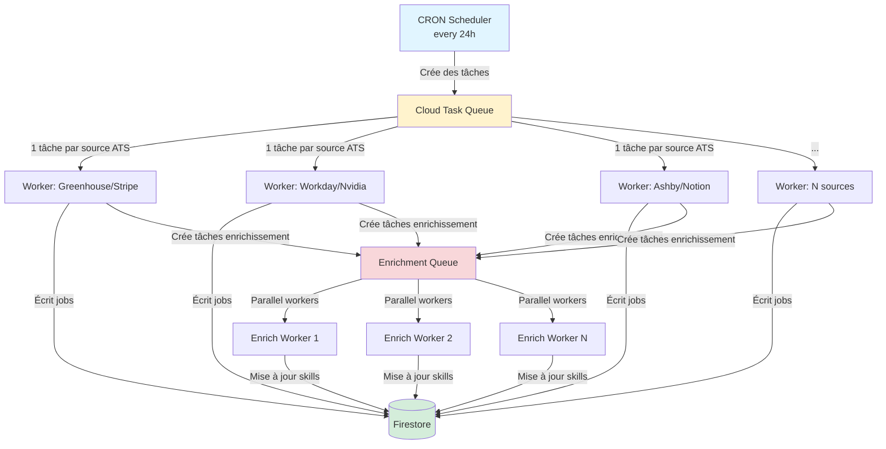

# 🔍 Diagnostic: Workday & Ashby + Recommandations de Scalabilité

## ✅ Résumé du Diagnostic

### **Bonne nouvelle: Tous les fetchers fonctionnent !**

J'ai testé tous les fetchers ATS et voici les résultats:

| ATS | Status | Jobs récupérés | Notes |
|-----|--------|----------------|-------|
| **Workday** (Nvidia) | ✅ | 2,000 jobs | Fonctionne parfaitement |
| **Ashby** (6 entreprises) | ✅ | 566 jobs | Toutes les entreprises OK |
| - Notion | ✅ | 131 jobs | |
| - Linear | ✅ | 18 jobs | |
| - Zapier | ✅ | 30 jobs | |
| - Replit | ✅ | 35 jobs | |
| - Ramp | ✅ | 128 jobs | |
| - Deel | ✅ | 224 jobs | |

**Total récupéré lors du test: 2,566 jobs**

---

## 🐛 Pourquoi tu ne vois que Greenhouse, Lever, SmartRecruiters ?

### Hypothèse la plus probable:

Le CRON Cloud Function **a probablement timeout** ou **échoué silencieusement** lors de la dernière exécution.

**Preuves:**
1. ✅ Les fetchers Workday/Ashby fonctionnent (test confirmé)
2. ❌ Tu ne vois pas leurs jobs dans la BDD
3. ⚠️ Le timeout est de 540s (9 minutes)
4. ⚠️ L'enrichissement LLM est activé (très lent)

**Ce qui s'est probablement passé:**

```
1. CRON démarre
2. Fetch Greenhouse ✅ (rapide)
3. Fetch Lever ✅ (rapide)
4. Fetch SmartRecruiters ✅ (lent mais OK)
5. Fetch Workday... 🕐 (en cours)
6. ⏰ TIMEOUT après 540s
7. Workday et Ashby non traités ❌
```

### Vérification:

Pour confirmer, vérifie les logs Cloud Functions:
```bash
firebase functions:log --only fetchJobsFromATS --limit 50
```

Tu devrais voir des erreurs de timeout ou d'exécution incomplète.

---

## 🚨 Problèmes critiques pour scale (100k+ jobs)

### 1. **Timeout Cloud Function (540s = 9 min)**
- Avec 100k+ jobs, même sans enrichissement, tu dépasseras ce timeout
- **Solution:** Architecture par queue (voir ci-dessous)

### 2. **Enrichissement LLM bloquant**
```typescript
// Dans fetchJobs.ts ligne 148-156
if (!normalized.skills?.length && normalized.description) {
    const skills = await extractSkillsWithLLM(...); // ❌ BLOQUANT
}
```
- Avec 50k jobs sans skills = 50k appels LLM séquentiels
- **Impossible** dans un timeout de 540s
- **Solution:** Enrichissement asynchrone en arrière-plan

### 3. **SmartRecruiters fait une requête par job**
```typescript
// Dans atsFetchers.ts ligne 110-111
for (const p of postings) {
    const detailUrl = `https://api.smartrecruiters.com/.../postings/${id}`;
    const d = await fetchJson<any>(detailUrl); // ❌ 1 requête par job
}
```
- 1000 jobs SmartRecruiters = 1000 requêtes HTTP séquentielles
- **Solution:** Parallélisation + rate limiting

### 4. **BulkWriter accumule tout en mémoire**
```typescript
const batch = db.bulkWriter(); // Accumule TOUS les jobs
for (const j of jobs) {
    batch.set(ref, normalized); // Ajout en mémoire
}
await batch.close(); // Flush à la fin
```
- 100k jobs × ~5KB/job = **500MB** en mémoire
- **Limite:** 1GiB configurée
- **Solution:** Batching par chunks

### 5. **Limitation arbitraire Workday**
```typescript
if (offset > 2000) break; // ❌ Max 2000 jobs par entreprise
```
- Certaines grandes entreprises ont 10k+ jobs sur Workday
- **Solution:** Configuration flexible par entreprise

---

## ✅ Recommandations Architecture

### **Option 1: Architecture par Queue (RECOMMANDÉ pour 100k+)**

#### Avantages:
- ✅ **Pas de timeout global** - chaque source a son propre timeout
- ✅ **Retry automatique** - si une source échoue, elle est retentée
- ✅ **Parallélisation contrôlée** - traite 10 sources en parallèle max
- ✅ **Monitoring précis** - tu sais exactement quelle source a échoué
- ✅ **Scalable à l'infini** - peut gérer des millions de jobs

#### Architecture:



#### Code:

```typescript
// 1. CRON léger qui crée des tâches (< 60s execution)
export const scheduleFetchJobs = onSchedule({
    schedule: 'every 24 hours',
    timeoutSeconds: 60,
}, async () => {
    const queue = getFunctions().taskQueue('fetchJobsQueue');
    
    console.log(`[SCHEDULER] Creating ${ATS_SOURCES.length} tasks`);
    
    for (const source of ATS_SOURCES) {
        await queue.enqueue({
            source,
            timestamp: Date.now(),
        });
    }
    
    console.log(`[SCHEDULER] All tasks created`);
});

// 2. Worker qui traite UNE source ATS
export const fetchJobsWorker = onTaskDispatched({
    retryConfig: {
        maxAttempts: 3,
        minBackoffSeconds: 60,
    },
    rateLimits: {
        maxConcurrentDispatches: 10, // Max 10 sources en parallèle
    },
    memory: '2GiB',
    timeoutSeconds: 540, // 9 min par source
}, async (req) => {
    const { source, timestamp } = req.data;
    const db = admin.firestore();
    
    console.log(`[WORKER] Processing ${source.provider}/${source.company}`);
    
    try {
        // Fetch les jobs de CETTE source uniquement
        let jobs: NormalizedATSJob[] = [];
        
        if (source.provider === "greenhouse" && source.company) {
            jobs = await fetchGreenhouse(source.company);
        } else if (source.provider === "workday" && source.company) {
            jobs = await fetchWorkday(source.company, source.workdayDomain, source.workdaySiteId);
        }
        // ... autres providers
        
        // Écriture par batches de 500
        const BATCH_SIZE = 500;
        let written = 0;
        
        for (let i = 0; i < jobs.length; i += BATCH_SIZE) {
            const chunk = jobs.slice(i, i + BATCH_SIZE);
            const batch = db.batch();
            
            for (const j of chunk) {
                const docId = `${j.ats}_${j.externalId}`;
                const ref = db.collection('jobs').doc(docId);
                const normalized = normalizeJob(j);
                
                batch.set(ref, {
                    ...normalized,
                    enrichmentStatus: 'pending', // À enrichir plus tard
                }, { merge: true });
            }
            
            await batch.commit();
            written += chunk.length;
            console.log(`[WORKER] Written ${written}/${jobs.length} jobs`);
        }
        
        // Créer des tâches d'enrichissement
        const enrichQueue = getFunctions().taskQueue('enrichSkillsQueue');
        for (const j of jobs) {
            if (!j.skills?.length && j.description) {
                await enrichQueue.enqueue({
                    jobId: `${j.ats}_${j.externalId}`,
                });
            }
        }
        
        console.log(`[WORKER] ✅ ${source.provider}/${source.company}: ${jobs.length} jobs`);
        
    } catch (error: any) {
        console.error(`[WORKER] ❌ ${source.provider}/${source.company}: ${error.message}`);
        throw error; // Retry automatique
    }
});

// 3. Worker d'enrichissement des skills
export const enrichSkillsWorker = onTaskDispatched({
    retryConfig: {
        maxAttempts: 2,
        minBackoffSeconds: 30,
    },
    rateLimits: {
        maxConcurrentDispatches: 50, // 50 enrichissements en parallèle
        maxDispatchesPerSecond: 10,  // Rate limit OpenAI
    },
    memory: '512MiB',
    timeoutSeconds: 60,
}, async (req) => {
    const { jobId } = req.data;
    const db = admin.firestore();
    
    try {
        const jobRef = db.collection('jobs').doc(jobId);
        const jobDoc = await jobRef.get();
        
        if (!jobDoc.exists) return;
        
        const data = jobDoc.data()!;
        
        // Skip si déjà enrichi
        if (data.enrichmentStatus === 'completed') return;
        
        // Enrichir avec LLM
        const skills = await extractSkillsWithLLM(
            `${data.title}\n${data.description}`
        );
        
        // Mettre à jour
        await jobRef.update({
            skills,
            enrichmentStatus: 'completed',
            enrichedAt: admin.firestore.FieldValue.serverTimestamp(),
        });
        
        console.log(`[ENRICH] ✅ ${jobId}: ${skills.length} skills`);
        
    } catch (error: any) {
        console.error(`[ENRICH] ❌ ${jobId}: ${error.message}`);
        // Marquer comme failed mais ne pas throw (pas de retry infini)
        await db.collection('jobs').doc(jobId).update({
            enrichmentStatus: 'failed',
        });
    }
});
```

#### Déploiement:

```bash
# 1. Déployer les fonctions
firebase deploy --only functions:scheduleFetchJobs,functions:fetchJobsWorker,functions:enrichSkillsWorker

# 2. Le CRON va automatiquement créer les tâches toutes les 24h
# 3. Monitoring dans la console Firebase
```

---

### **Option 2: Optimisations du système actuel (pour 10k jobs max)**

Si tu veux garder l'architecture actuelle mais l'optimiser:

#### A. Désactiver l'enrichissement LLM pendant le fetch

```typescript
// Dans fetchJobs.ts, COMMENTER lignes 148-156
// L'enrichissement sera fait en arrière-plan plus tard
```

#### B. Paralléliser SmartRecruiters

```typescript
// Dans atsFetchers.ts, remplacer la boucle for par:
const detailPromises = postings.map(async (p) => {
    const id = p.id || p.uuid;
    try {
        const detailUrl = `...`;
        const d = await fetchJson<any>(detailUrl);
        // ... traitement
        return normalizedJob;
    } catch (e) {
        console.warn(`...`);
        return fallbackJob;
    }
});

const list = await Promise.all(detailPromises);
```

#### C. Augmenter les limites Cloud Function

```typescript
export const fetchJobsFromATS = onSchedule({
    // ...
    timeoutSeconds: 3600,  // 1 heure au lieu de 9 min
    memory: '4GiB',        // 4GB au lieu de 1GB
});
```

#### D. Batching intelligent

```typescript
// Remplacer bulkWriter par batching manuel
const BATCH_SIZE = 500;
for (let i = 0; i < jobs.length; i += BATCH_SIZE) {
    const chunk = jobs.slice(i, i + BATCH_SIZE);
    const batch = db.batch();
    
    for (const j of chunk) {
        // ... set
    }
    
    await batch.commit();
}
```

---

## 🎯 Ma Recommandation

**Pour 100k+ jobs: Option 1 (Architecture par Queue)**

### Pourquoi?
- ✅ **Fiabilité**: Pas de timeout global, retry automatique
- ✅ **Scalabilité**: Supporte des millions de jobs
- ✅ **Observabilité**: Tu vois exactement ce qui échoue
- ✅ **Performance**: Enrichissement en parallèle
- ✅ **Coûts**: Paye seulement pour ce qui est utilisé

### Plan d'implémentation:

1. **Phase 1** (2h): Implémenter l'architecture par queue
2. **Phase 2** (1h): Tester avec les sources actuelles
3. **Phase 3** (30min): Déployer en production
4. **Phase 4** (ongoing): Ajouter des sources progressivement

---

## 📊 Comparaison des Options

| Critère | Architecture actuelle | Avec optimisations | Architecture Queue |
|---------|----------------------|-------------------|-------------------|
| **Max jobs supportés** | ~5k | ~20k | Illimité |
| **Timeout risk** | ❌ Élevé | ⚠️ Moyen | ✅ Aucun |
| **Enrichissement LLM** | ❌ Bloquant | ❌ Bloquant | ✅ Async |
| **Retry automatique** | ❌ Non | ❌ Non | ✅ Oui |
| **Complexité code** | ⭐ Simple | ⭐⭐ Moyen | ⭐⭐⭐ Avancé |
| **Temps implémentation** | - | 1h | 3h |
| **Monitoring** | ⚠️ Basique | ⚠️ Basique | ✅ Détaillé |
| **Coût** | 💰 | 💰💰 | 💰 |

---

## 🔧 Action immédiate pour voir Workday/Ashby

En attendant de choisir l'architecture, pour voir immédiatement les jobs Workday/Ashby:

```bash
# 1. Désactiver temporairement l'enrichissement LLM
# Commenter lignes 148-156 dans functions/src/fetchJobs.ts

# 2. Redéployer la fonction
firebase deploy --only functions:fetchJobsFromATS

# 3. Attendre 24h pour le prochain CRON
# OU trigger manuellement via la console Firebase
```

Ou si tu veux les voir immédiatement dans l'émulateur:

```bash
# 1. Démarrer les émulateurs
firebase emulators:start

# 2. Dans un autre terminal:
cd functions
USE_EMULATOR=true npm run fetch:local

# 3. Les jobs apparaîtront sur http://localhost:5178/jobs
```

---

**Question:** Tu veux que j'implémente l'architecture par queue maintenant, ou tu préfères d'abord faire les optimisations simples ?
