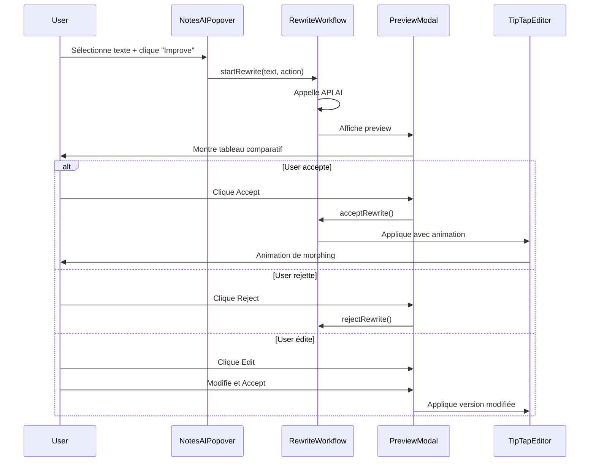

# Système de Réécriture AI - Style Notion

## Vue d'ensemble

Le système de réécriture AI a été complètement transformé pour offrir une expérience utilisateur fluide inspirée de Notion. Au lieu d'appliquer directement les modifications, le système affiche maintenant une prévisualisation élégante permettant à l'utilisateur de valider, rejeter ou modifier les changements avant de les appliquer.

## Fonctionnalités

### ✨ Prévisualisation Avant/Après
- **Vue comparative côte à côte** : Original à gauche, version réécrite à droite
- **Diff highlighting** : Les modifications sont surlignées automatiquement
  - 🟢 Vert : Ajouts
  - 🔴 Rouge : Suppressions
  - Texte normal : Inchangé
- **Statistiques en temps réel** : Nombre de mots ajoutés/supprimés, pourcentage de similarité

### 🎯 Actions Utilisateur
- **Accept** : Applique les modifications avec une animation fluide
- **Reject** : Ferme la modal sans rien changer
- **Edit** : Permet de modifier le texte réécrit avant de l'appliquer

### 🎨 Animations Fluides
- Ouverture/fermeture de modal avec spring animation
- Morphing de texte lors de l'application
- Highlight temporaire de la zone modifiée
- Animations progressives des différences

### ⌨️ Raccourcis Clavier
- `⌘/Ctrl + Enter` : Accepter les modifications
- `Escape` : Rejeter et fermer

## Architecture

### Composants Créés

#### 1. `TextDiffViewer.tsx`
Composant de visualisation des différences entre deux textes.

**Localisation** : `src/components/assistant/TextDiffViewer.tsx`

**Props** :
```typescript
interface TextDiffViewerProps {
  originalText: string;
  rewrittenText: string;
  showAnimation?: boolean; // Par défaut: true
}
```

**Utilisation** :
```tsx
import TextDiffViewer from '@/components/assistant/TextDiffViewer';

<TextDiffViewer 
  originalText="Texte original" 
  rewrittenText="Texte modifié"
/>
```

#### 2. `RewritePreviewModal.tsx`
Modal principale de prévisualisation des modifications.

**Localisation** : `src/components/assistant/RewritePreviewModal.tsx`

**Props** :
```typescript
interface RewritePreviewModalProps {
  isOpen: boolean;
  onClose: () => void;
  originalText: string;
  rewrittenText: string;
  actionType: 'improve' | 'shorten' | 'expand' | 'formal' | 'casual' | 'grammar';
  onAccept: () => Promise<void>;
  onReject: () => void;
  onEdit?: (text: string) => void;
}
```

**Utilisation** :
```tsx
import RewritePreviewModal from '@/components/assistant/RewritePreviewModal';

<RewritePreviewModal
  isOpen={isOpen}
  onClose={handleClose}
  originalText="Original"
  rewrittenText="Rewritten"
  actionType="improve"
  onAccept={handleAccept}
  onReject={handleReject}
  onEdit={handleEdit}
/>
```

#### 3. `RewriteAnimationWrapper.tsx`
Wrapper pour gérer les animations lors de l'application des modifications.

**Localisation** : `src/components/assistant/RewriteAnimationWrapper.tsx`

**Types d'animation disponibles** :
- `fade` : Fondu simple
- `slide` : Glissement latéral
- `morph` : Effet de morphing avec blur (par défaut)
- `none` : Pas d'animation

**Utilisation** :
```tsx
import RewriteAnimationWrapper from '@/components/assistant/RewriteAnimationWrapper';

<RewriteAnimationWrapper
  isApplying={isApplying}
  animationType="morph"
  onAnimationComplete={handleComplete}
>
  {children}
</RewriteAnimationWrapper>
```

#### 4. Hook `useRewriteWorkflow`
Hook custom pour gérer l'état et la logique du workflow de réécriture.

**Localisation** : `src/hooks/useRewriteWorkflow.ts`

**API** :
```typescript
const {
  // État
  isPreviewOpen,      // Modal ouverte ?
  isProcessing,       // En cours de traitement AI ?
  isApplying,         // En cours d'application ?
  originalText,       // Texte original
  rewrittenText,      // Texte réécrit
  actionType,         // Type d'action
  error,              // Erreur éventuelle
  
  // Actions
  startRewrite,       // Démarrer une réécriture
  acceptRewrite,      // Accepter les modifications
  rejectRewrite,      // Rejeter les modifications
  closePreview,       // Fermer la prévisualisation
  editRewrite,        // Éditer le texte réécrit
  
  // Historique
  rewriteHistory,     // Historique des réécritures
  undoLastRewrite,    // Annuler la dernière réécriture
  canUndo,            // Peut-on annuler ?
} = useRewriteWorkflow({
  onApply: (text) => {
    // Fonction appelée pour appliquer le texte
  },
  maxHistorySize: 10, // Taille max de l'historique
});
```

**Exemple d'utilisation** :
```tsx
import { useRewriteWorkflow } from '@/hooks/useRewriteWorkflow';

function MyComponent() {
  const {
    isPreviewOpen,
    originalText,
    rewrittenText,
    actionType,
    startRewrite,
    acceptRewrite,
    rejectRewrite,
  } = useRewriteWorkflow({
    onApply: (text) => {
      // Appliquer le texte dans l'éditeur
      editor.setContent(text);
    },
  });

  const handleImprove = async () => {
    await startRewrite(selectedText, {
      id: 'improve',
      label: 'Improve',
      tone: 'professional',
    });
  };

  return (
    <>
      <button onClick={handleImprove}>Improve</button>
      
      {isPreviewOpen && actionType && (
        <RewritePreviewModal
          isOpen={isPreviewOpen}
          originalText={originalText}
          rewrittenText={rewrittenText}
          actionType={actionType}
          onAccept={acceptRewrite}
          onReject={rejectRewrite}
        />
      )}
    </>
  );
}
```

### Utilitaires

#### `textDiff.ts`
Algorithme de diff basé sur LCS (Longest Common Subsequence).

**Localisation** : `src/utils/textDiff.ts`

**Fonctions disponibles** :
```typescript
// Calculer les différences
const diff = computeTextDiff(original, rewritten);
// Retourne: DiffSegment[] = { type: 'added' | 'removed' | 'unchanged', text: string }[]

// Calculer la similarité (0-100%)
const similarity = calculateSimilarity(original, rewritten);

// Obtenir les statistiques
const stats = getChangeStats(original, rewritten);
// Retourne: { additions, deletions, unchanged, totalChanges }
```

## Modifications des Composants Existants

### `NotesAIPopover.tsx`
Le popover AI a été mis à jour pour utiliser le nouveau workflow au lieu d'appliquer directement les modifications.

**Avant** :
```typescript
const rewrittenText = await rewriteTextWithAI({ text, tone });
onRewrite(rewrittenText); // Application directe
```

**Après** :
```typescript
await startRewrite(selectedText, action); // Ouvre la modal de prévisualisation
```

### `EditActionButton.tsx`
Le bouton d'édition dans le chat assistant a maintenant un bouton "Preview" en plus du bouton "Apply".

**Nouvelles fonctionnalités** :
- Bouton "Preview" pour voir les changements avant de les appliquer
- Bouton "Apply" pour appliquer directement (comportement existant conservé)

### `AssistantContext.tsx`
Le contexte assistant a été enrichi avec de nouvelles propriétés pour gérer l'état des réécritures.

**Nouvelles propriétés** :
```typescript
interface AssistantContextType {
  // ... propriétés existantes ...
  
  // Nouvelles propriétés
  rewriteInProgress: boolean;
  setRewriteInProgress: (inProgress: boolean) => void;
  pendingRewrite: PendingRewrite | null;
  setPendingRewrite: (rewrite: PendingRewrite | null) => void;
  applyRewrite: () => Promise<void>;
  rejectRewrite: () => void;
}
```

## Workflow Utilisateur



## Exemples d'Utilisation

### 1. Intégrer le système dans un nouvel éditeur

```tsx
import { useRewriteWorkflow } from '@/hooks/useRewriteWorkflow';
import RewritePreviewModal from '@/components/assistant/RewritePreviewModal';
import { useEditor } from '@tiptap/react';

function MyEditor() {
  const editor = useEditor({...});
  
  const {
    isPreviewOpen,
    originalText,
    rewrittenText,
    actionType,
    startRewrite,
    acceptRewrite,
    rejectRewrite,
  } = useRewriteWorkflow({
    onApply: (text) => {
      // Appliquer dans l'éditeur TipTap
      const { from, to } = editor.state.selection;
      editor.chain()
        .focus()
        .deleteRange({ from, to })
        .insertContent(text)
        .run();
    },
  });

  const handleRewrite = async (action) => {
    const selectedText = editor.state.doc.textBetween(
      editor.state.selection.from,
      editor.state.selection.to
    );
    await startRewrite(selectedText, action);
  };

  return (
    <>
      <EditorContent editor={editor} />
      
      {isPreviewOpen && actionType && (
        <RewritePreviewModal
          isOpen={isPreviewOpen}
          originalText={originalText}
          rewrittenText={rewrittenText}
          actionType={actionType}
          onAccept={acceptRewrite}
          onReject={rejectRewrite}
        />
      )}
    </>
  );
}
```

### 2. Utiliser le diff viewer standalone

```tsx
import TextDiffViewer from '@/components/assistant/TextDiffViewer';

function ComparisonView() {
  const [original, setOriginal] = useState('');
  const [modified, setModified] = useState('');

  return (
    <div>
      <TextDiffViewer
        originalText={original}
        rewrittenText={modified}
        showAnimation={true}
      />
    </div>
  );
}
```

## Personnalisation

### Couleurs
Les couleurs peuvent être personnalisées dans Tailwind :
- Ajouts : `bg-emerald-100 dark:bg-emerald-900/30`
- Suppressions : `bg-red-100 dark:bg-red-900/30`
- Couleur primaire : `#635BFF` (violet Jobzai)

### Animations
Les animations peuvent être ajustées dans `RewriteAnimationWrapper.tsx` :
- Durée : Modifier `duration` dans les variants
- Type : Changer `animationType` prop
- Easing : Ajuster les courbes de transition

## Support Dark Mode

Tous les composants supportent le dark mode automatiquement grâce aux classes Tailwind `dark:`.

## Performance

- **Algorithme de diff** : Complexité O(m×n) avec optimisation LCS
- **Animations** : Utilise Framer Motion pour des performances 60fps
- **Rendu conditionnel** : Les modals sont montées uniquement quand nécessaire

## Accessibilité

- Raccourcis clavier supportés
- Labels ARIA pour les boutons
- Focus management dans les modals
- Support navigation clavier

## Tests Manuels Recommandés

1. ✅ Sélectionner du texte → Cliquer "Improve" → Vérifier modal s'ouvre
2. ✅ Comparer original vs rewritten → Vérifier diff highlighting
3. ✅ Accepter → Vérifier animation fluide + texte appliqué
4. ✅ Rejeter → Vérifier rien ne change
5. ✅ Éditer → Modifier texte → Accepter → Vérifier version modifiée appliquée
6. ⏳ Tester sur mobile (layout vertical)
7. ⏳ Tester en dark mode
8. ⏳ Tester les raccourcis clavier

## Dépendances

Toutes les dépendances nécessaires sont déjà installées :
- ✅ `framer-motion` - Animations
- ✅ `react` - Framework
- ✅ `tailwindcss` - Styling
- ✅ `@tiptap/react` - Éditeur de texte

## Troubleshooting

### La modal ne s'ouvre pas
- Vérifier que `isPreviewOpen` est bien `true`
- Vérifier que `actionType` n'est pas `null`
- Vérifier les logs console pour les erreurs API

### Les différences ne s'affichent pas correctement
- Vérifier que les textes ne sont pas vides
- Vérifier que l'algorithme de diff retourne bien des segments
- Tester avec des textes plus courts pour debug

### Les animations sont saccadées
- Vérifier que Framer Motion est bien installé
- Réduire le nombre d'animations simultanées
- Utiliser `animationType="none"` pour désactiver temporairement

## Améliorations Futures

- [ ] Support des images dans le diff
- [ ] Historique persistant avec localStorage
- [ ] Undo/Redo multi-niveaux
- [ ] Support des changements de format (gras, italique, etc.)
- [ ] Export des comparaisons en PDF
- [ ] Suggestions AI inline (comme Copilot)

## Contributeurs

Ce système a été développé pour améliorer l'expérience utilisateur de Jobz.ai en s'inspirant des meilleures pratiques de Notion.

